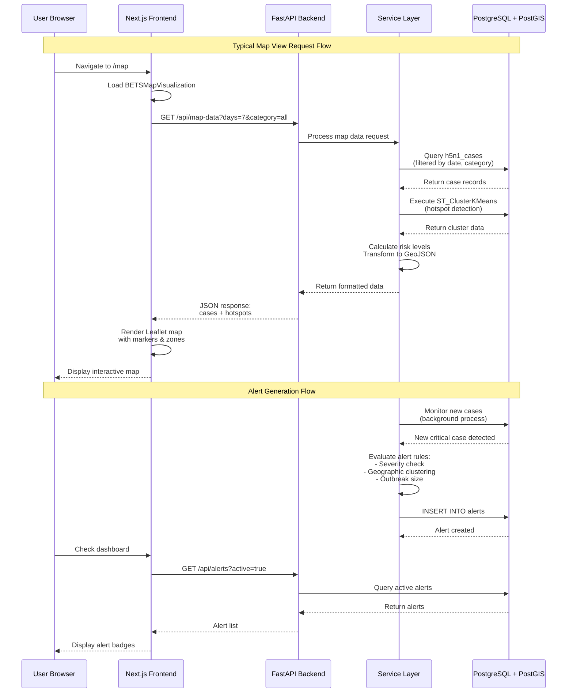
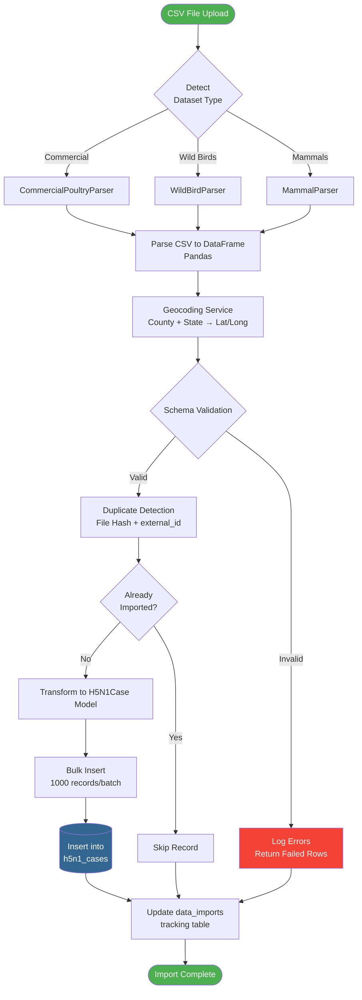
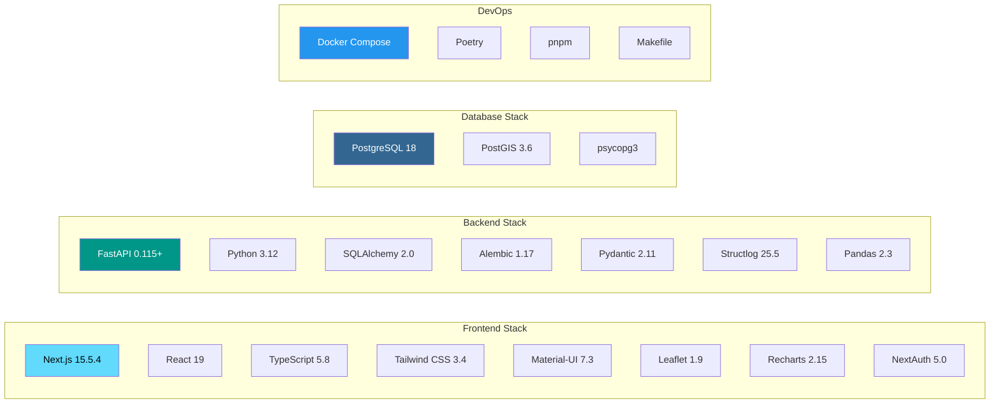
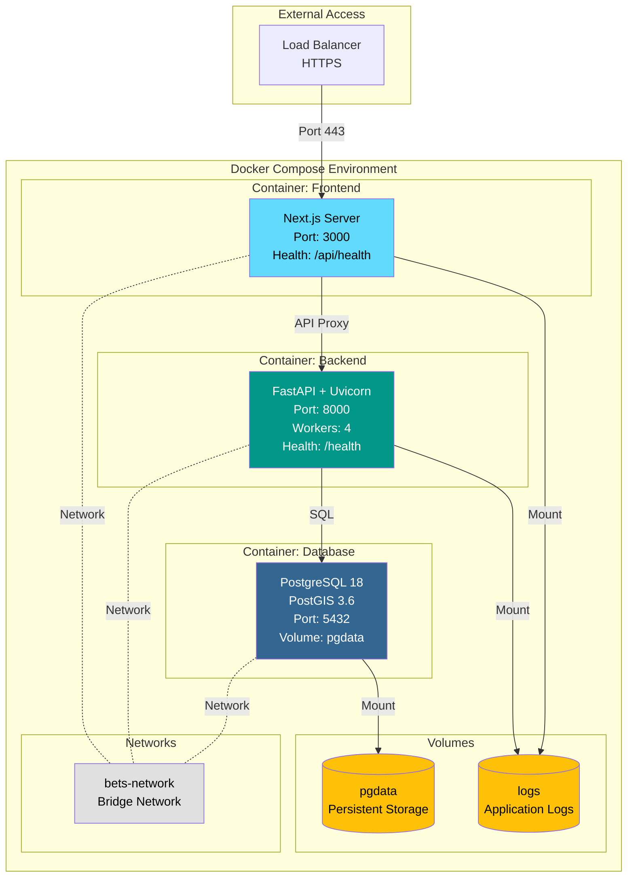
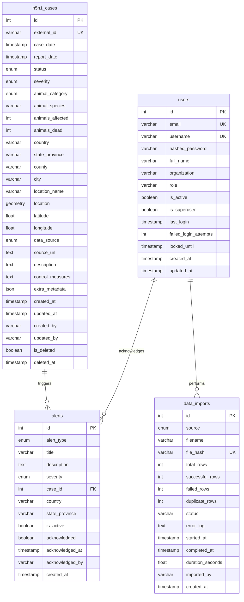
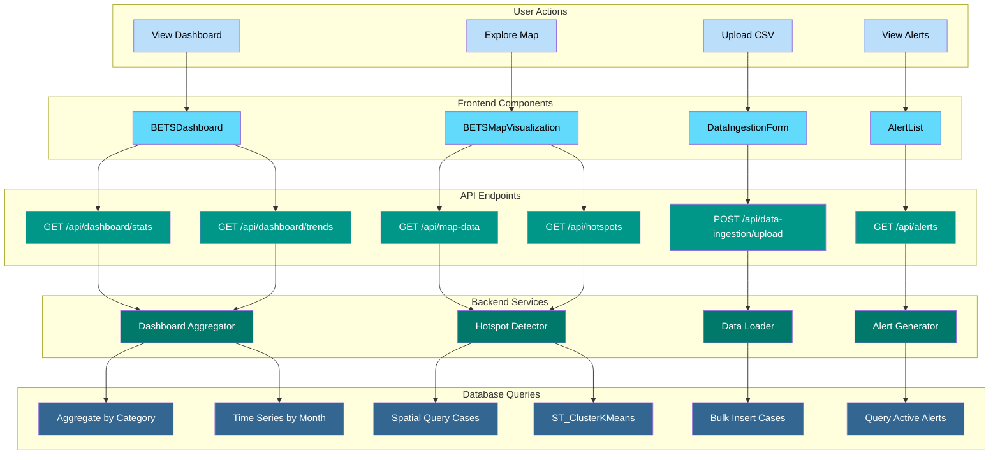
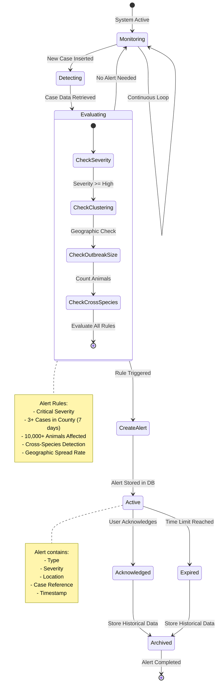
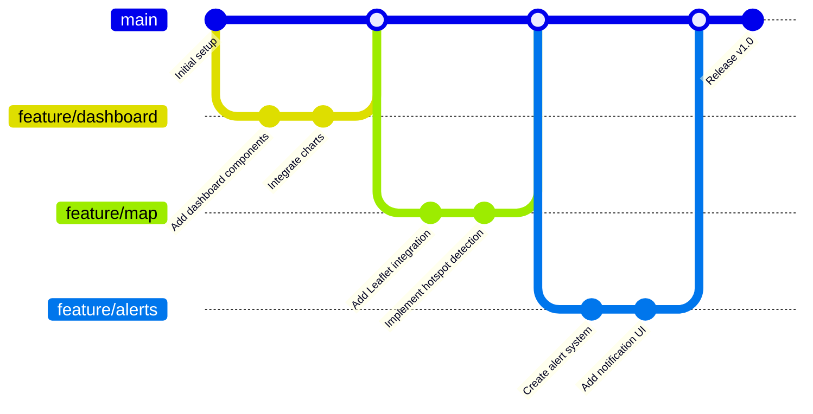
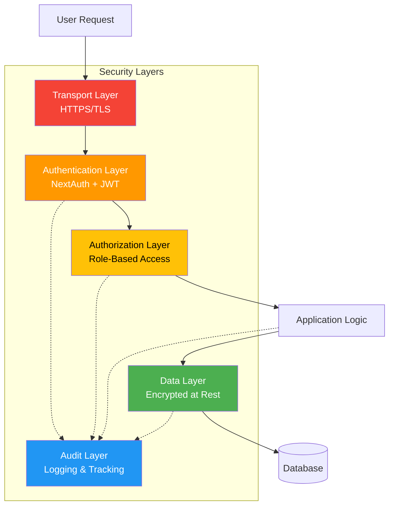

# BETS Architecture Diagram

## System Overview

```mermaid
graph TB
    subgraph "Client Layer"
        USER[User Browser]
    end

    subgraph "Frontend Layer - Next.js 15.5.4"
        NEXTJS[Next.js App Router<br/>Port 3000]

        subgraph "Pages"
            DASHBOARD[Dashboard Page<br/>/dashboard]
            MAP[Map Page<br/>/map]
            SETTINGS[Settings Page<br/>/settings]
        end

        subgraph "Components"
            MAPVIS[BETSMapVisualization<br/>Leaflet + Clustering]
            CHARTS[Charts Components<br/>Recharts]
            CARDS[Metric Cards<br/>Stats Display]
        end

        subgraph "Services"
            APISERVICE[betsApi Service<br/>HTTP Client]
        end

        subgraph "Frontend Features"
            AUTH[NextAuth 5.0<br/>Authentication]
            VALIDATION[Zod Schema<br/>Validation]
        end
    end

    subgraph "Backend Layer - FastAPI"
        FASTAPI[FastAPI App<br/>Port 8000]

        subgraph "API Routes"
            R_DASHBOARD[/api/dashboard/*<br/>Aggregations]
            R_MAP[/api/map-data<br/>Cases + Hotspots]
            R_ALERTS[/api/alerts/*<br/>Alert System]
            R_INGEST[/api/data-ingestion/*<br/>CSV Upload]
            R_ANALYTICS[/api/analytics/*<br/>Analysis]
        end

        subgraph "Services & Business Logic"
            S_HOTSPOT[Hotspot Detection<br/>PostGIS KMeans]
            S_ALERT[Alert Generation<br/>Rule Engine]
            S_GEO[Geocoding Service<br/>County → Lat/Long]
            S_TRANSFORM[Data Transformers]
        end

        subgraph "Data Parsers"
            P_COMMERCIAL[Commercial Poultry<br/>Parser]
            P_WILD[Wild Bird<br/>Parser]
            P_MAMMAL[Mammal<br/>Parser]
            P_BASE[Base Parser<br/>Template]
        end

        subgraph "Validators"
            V_SCHEMA[Schema Validator<br/>Enums + Rules]
            V_DATA[Data Validator<br/>Business Logic]
        end

        subgraph "ORM Layer"
            ORM[SQLAlchemy 2.0<br/>Models + Sessions]
            MODELS[Models:<br/>H5N1Case, Alert,<br/>DataImport, User]
        end
    end

    subgraph "Data Layer - PostgreSQL 18 + PostGIS 3.6"
        DB[(PostgreSQL Database<br/>Port 5432)]

        subgraph "Tables"
            T_CASES[h5n1_cases<br/>40,000+ records<br/>GEOMETRY column]
            T_ALERTS[alerts<br/>Alert tracking]
            T_IMPORTS[data_imports<br/>Import history]
            T_USERS[users<br/>Authentication]
        end

        subgraph "PostGIS Features"
            SPATIAL[ST_ClusterKMeans<br/>Spatial Queries<br/>GIST Indexes]
        end
    end

    subgraph "Data Sources"
        CSV_COMMERCIAL[Commercial Poultry CSV<br/>~200 records]
        CSV_WILD[Wild Birds CSV<br/>~40,000 records]
        CSV_MAMMAL[Mammals CSV<br/>~150 records]
    end

    subgraph "External Services"
        AZURE[Azure AD<br/>Optional SSO]
        WOAH[WOAH API<br/>Future]
        CDC[CDC API<br/>Future]
        USDA[USDA API<br/>Future]
    end

    %% User interactions
    USER -->|HTTPS| NEXTJS

    %% Frontend routing
    NEXTJS --> DASHBOARD
    NEXTJS --> MAP
    NEXTJS --> SETTINGS

    %% Component usage
    DASHBOARD --> CHARTS
    DASHBOARD --> CARDS
    MAP --> MAPVIS

    %% API calls
    DASHBOARD -->|API Calls| APISERVICE
    MAP -->|API Calls| APISERVICE
    APISERVICE -->|HTTP REST| FASTAPI

    %% Authentication
    AUTH -.->|OAuth| AZURE

    %% Backend routing
    FASTAPI --> R_DASHBOARD
    FASTAPI --> R_MAP
    FASTAPI --> R_ALERTS
    FASTAPI --> R_INGEST
    FASTAPI --> R_ANALYTICS

    %% Service layer
    R_DASHBOARD --> S_TRANSFORM
    R_MAP --> S_HOTSPOT
    R_MAP --> S_TRANSFORM
    R_ALERTS --> S_ALERT
    R_INGEST --> P_COMMERCIAL
    R_INGEST --> P_WILD
    R_INGEST --> P_MAMMAL

    %% Parser flow
    P_COMMERCIAL --> P_BASE
    P_WILD --> P_BASE
    P_MAMMAL --> P_BASE
    P_BASE --> S_GEO
    P_BASE --> V_SCHEMA
    P_BASE --> V_DATA

    %% ORM usage
    S_HOTSPOT --> ORM
    S_ALERT --> ORM
    S_TRANSFORM --> ORM
    V_DATA --> ORM
    ORM --> MODELS

    %% Database connections
    MODELS -->|psycopg3| DB

    %% Table relationships
    DB --> T_CASES
    DB --> T_ALERTS
    DB --> T_IMPORTS
    DB --> T_USERS
    T_CASES -.->|Uses| SPATIAL

    %% Data ingestion
    CSV_COMMERCIAL -->|Upload| R_INGEST
    CSV_WILD -->|Upload| R_INGEST
    CSV_MAMMAL -->|Upload| R_INGEST

    %% External API connections (future)
    R_INGEST -.->|Future| WOAH
    R_INGEST -.->|Future| CDC
    R_INGEST -.->|Future| USDA

    %% Styling
    classDef frontend fill:#61dafb,stroke:#333,stroke-width:2px,color:#000
    classDef backend fill:#009688,stroke:#333,stroke-width:2px,color:#fff
    classDef database fill:#336791,stroke:#333,stroke-width:2px,color:#fff
    classDef external fill:#ff9800,stroke:#333,stroke-width:2px,color:#000
    classDef data fill:#4caf50,stroke:#333,stroke-width:2px,color:#fff

    class NEXTJS,DASHBOARD,MAP,SETTINGS,MAPVIS,CHARTS,CARDS,APISERVICE,AUTH,VALIDATION frontend
    class FASTAPI,R_DASHBOARD,R_MAP,R_ALERTS,R_INGEST,R_ANALYTICS,S_HOTSPOT,S_ALERT,S_GEO,S_TRANSFORM,P_COMMERCIAL,P_WILD,P_MAMMAL,P_BASE,V_SCHEMA,V_DATA,ORM,MODELS backend
    class DB,T_CASES,T_ALERTS,T_IMPORTS,T_USERS,SPATIAL database
    class AZURE,WOAH,CDC,USDA external
    class CSV_COMMERCIAL,CSV_WILD,CSV_MAMMAL data
```

## Data Flow Diagram



## Data Ingestion Pipeline



## Technology Stack



## Deployment Architecture



## Database Schema



## Component Interaction Map



## Alert System Architecture



---

## Key Features Summary

### 1. Real-Time Monitoring
- Dashboard with live statistics
- Time series trend analysis
- Geographic distribution tracking

### 2. Spatial Analysis
- Interactive map with Leaflet
- PostGIS-powered hotspot detection
- Cluster visualization with risk zones
- County-level aggregation

### 3. Data Management
- Multi-source CSV ingestion
- Automated geocoding
- Duplicate detection
- Import tracking and auditing

### 4. Alert System
- Rule-based alert generation
- Severity escalation
- Geographic clustering detection
- User acknowledgment workflow

### 5. Security & Access
- NextAuth 5.0 ready
- Role-based access control
- Azure AD integration support
- Audit trails

---

## Performance Considerations

### Database Optimization
- GIST spatial indexes for geographic queries
- Composite indexes on frequently filtered columns
- Connection pooling (SQLAlchemy)
- Bulk insert operations (1000 records/batch)

### Frontend Optimization
- Next.js SSR for initial page loads
- React 19 concurrent features
- Leaflet marker clustering (reduces DOM nodes)
- Lazy loading for large datasets

### Backend Optimization
- FastAPI async endpoints
- Uvicorn with multiple workers
- Structlog for efficient logging
- Pydantic for fast validation

---

## Development Workflow



---

## Monitoring & Logging

### Structured Logging (Structlog)
- Request/response logging
- Database query logging
- Error tracking with stack traces
- Performance metrics

### Health Checks
- Frontend: `GET /api/health`
- Backend: `GET /health`
- Database: Connection pool status

### Metrics Tracked
- API response times
- Database query performance
- Data import success rates
- Alert generation frequency
- User authentication events

---

## Security Architecture



---

## Future Enhancements

### Planned Features
1. **Real-Time Updates**: WebSocket integration for live dashboard
2. **Mobile App**: React Native mobile application
3. **Advanced Analytics**: ML-based outbreak prediction
4. **Export Functionality**: PDF reports, Excel exports
5. **Public API**: RESTful API for external integrations
6. **Notification System**: Email/SMS alerts
7. **Dark Mode**: Theme switching support
8. **Multi-Language**: i18n internationalization

### Scalability Roadmap
- Redis caching layer
- Load balancer (Nginx/Traefik)
- Database read replicas
- CDN for static assets
- Kubernetes deployment
- Microservices architecture (if needed)

---

*This architecture documentation was generated for the BETS (Bio-Event Tracking System) project.*
*Last updated: 2025-11-18*
